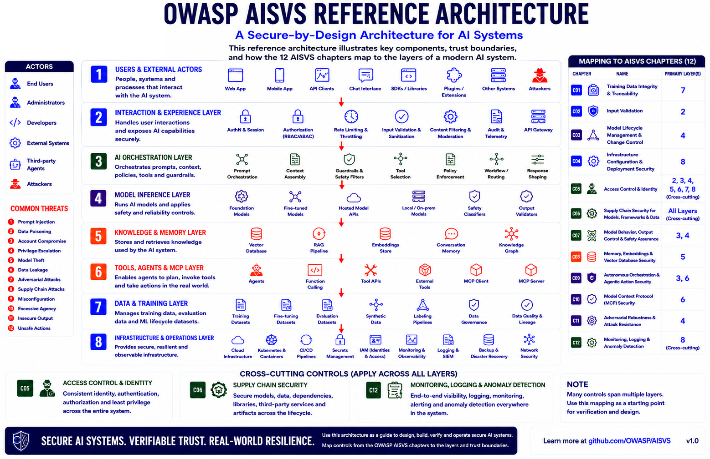
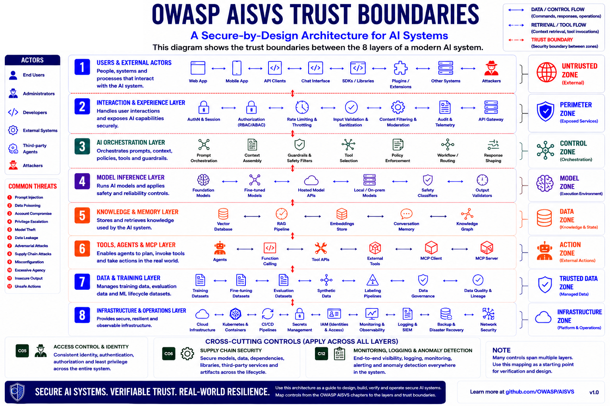

# Appendix F: Reference Architecture & Trust Boundaries

> This appendix is for information only. Nothing in it is a requirement, and
> nothing in it is tested or scored. It is background material to help you see
> where the AISVS controls fit in a real AI system.

## F.1 Overview

Modern AI systems are built from layers: the people and clients that interact
with them, the services that handle those interactions, the orchestration that
drives the model, the model itself, the knowledge and memory it draws on, the
tools and agents it acts through, the data it is trained and evaluated on, and
the infrastructure underneath. The reference architecture (Figure F-1) groups
these into eight layers and shows where the twelve AISVS chapters apply, so you
can locate each control in a real system.

_Figure F-1: AISVS Reference Architecture._

## F.2 The Eight Layers

1. Users & External Actors -- people, systems and processes that interact with the AI system.
2. Interaction & Experience -- handles user interactions and exposes AI capabilities (authentication, input validation, rate limiting, filtering).
3. AI Orchestration -- prompts, context, policies, tools and guardrails.
4. Model Inference -- runs the models and applies safety and reliability controls.
5. Knowledge & Memory -- stores and retrieves the knowledge the system uses (vector stores, RAG, embeddings).
6. Tools, Agents & MCP -- lets agents plan, call tools and take real-world actions.
7. Data & Training -- manages training, fine-tuning and evaluation data across the lifecycle.
8. Infrastructure & Operations -- provides secure, resilient and observable infrastructure.

## F.3 Cross-Cutting Controls

Three chapters apply across every layer rather than to one:

- C05 Access Control & Identity -- consistent identity, authentication, authorization and least privilege.
- C06 Supply Chain Security -- securing models, data, dependencies and artifacts across the lifecycle.
- C12 Monitoring, Logging & Anomaly Detection -- end-to-end visibility and detection everywhere in the system.

## F.4 Trust Boundaries

A trust boundary is where data or control passes between zones that hold
different levels of trust. Each layer sits in a zone, from the Untrusted Zone at
the edge to the Infrastructure Zone underneath (Figure F-2). At every boundary,
data and control flows should be validated, authorized and monitored. Treat
anything crossing into a higher-trust zone as untrusted until it is checked.

_Figure F-2: AISVS Trust Boundaries._

## F.5 Using This Appendix

Locate the component you are assessing, find its layer and zone, then apply the
AISVS chapters that map to it. The diagrams are a starting point to adapt to your
own system, not a fixed blueprint.
