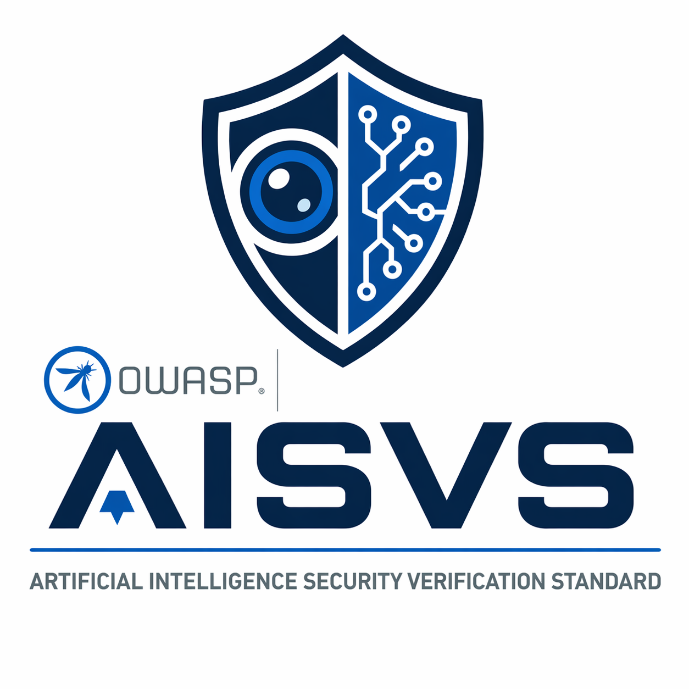

  

# Contributing

## Introduction

### What is [OWASP](https://owasp.org/)?

The Open Worldwide Application Security Project (OWASP) is a nonprofit organization that works to improve the security of software. It has many programs that work toward this goal. One of those programs is the AISVS.

### What is the [AISVS](https://github.com/OWASP/www-project-artificial-intelligence-security-verification-standard-aisvs-docs)?

The OWASP Artificial Intelligence Security Verification Standard (AISVS) focuses on providing developers, architects, and security professionals with a structured framework to evaluate and verify the security and ethical considerations of AI-driven applications. Modeled after existing OWASP standards (such as the ASVS for web applications), AISVS defines categories of requirements across 12 chapters covering areas including model behavior, supply chain integrity, agentic orchestration, adversarial robustness, and human oversight.

### What is the current status of AISVS development?

**We are in the final stretch before the v1.0 requirement freeze.**

**1.0 Release Date: June 24, 2026** at the OWASP Global AppSec conference in Vienna.

## How can I help?

### High-priority contributions for the 1.0 release

The most valuable thing you can do right now is review the existing controls and ask:

- Is this requirement independently testable? Can a single auditor verify it with a single, specific piece of evidence?
- Is the scope clear? Could this control be confused with a control in a different chapter?
- Is anything missing? Are there attack surfaces, failure modes, or real-world AI security concerns that are not covered?
- Is anything duplicated? Do two controls in the same or different chapters say the same thing?

If you find issues, please open a GitHub issue first before submitting a pull request. Good issues describing the problem are just as valuable as PRs.

### Other ways to contribute

- **Review open PRs**: Help us catch scope overlap, wording ambiguity, or controls that are hard to test in practice.
- **Add missing controls**: If you know of a concrete, testable requirement that belongs in the standard and is not there yet, propose it.
- **Fix compound requirements**: Controls that bundle two distinct testable concerns into one should be split. See our existing split PRs for examples of the expected format.
- **Improve references**: Each chapter should reference the best available standards, frameworks, and research for its topic area.

Please first log ideas, issues, or questions here: <https://github.com/OWASP/AISVS/issues>.

We may also ask you to open a pull request, <https://github.com/OWASP/AISVS/pulls>, based on the discussion in the issue.

### Translations

We are looking for help with translations after v1.0 is released!

## Release Policy

AISVS uses a two-part `v<MAJOR>.<MINOR>` version scheme and a published release policy that defines what can change in a minor release, what requires a major release, and how patch-level fixes are handled in-branch without a separate version. See [RELEASE.md](RELEASE.md) before proposing changes that add, remove, or restructure requirements.

## AI-Assisted Contributions

AI tools are welcome as a productivity aid across the entire contribution workflow, including drafting issues, writing PR descriptions, sketching initial requirement text, spotting gaps, or formulating review comments. If it gets good ideas into the project faster, use it.

The line is ownership and substance. Every contribution must reflect the contributor's own security judgment, whether that contribution is a requirement, a PR description, a review comment, or an issue. What we want to avoid:

- Submitting large blocks of AI-generated text without reviewing or editing it. If you would not defend every sentence in a discussion, it should not be in your issue, PR, or comment.
- Using AI to pad a contribution. A thin idea wrapped in generated prose is still a thin idea, and reviewers will notice.
- Requirements or requirement text that reads as generic boilerplate rather than a concrete, testable control. AISVS controls must be independently verifiable; vague filler fails that bar regardless of how it was produced.
- Review comments that restate what is already visible in the diff without adding security judgment. AI-assisted reviews are welcome; AI-generated summaries posted as reviews are not.

What good AI-assisted contribution looks like: you have a security concern or a point to make, you use AI to help articulate it clearly, and you submit something you can fully explain and defend. The AI helped you write it; the judgment is yours.
